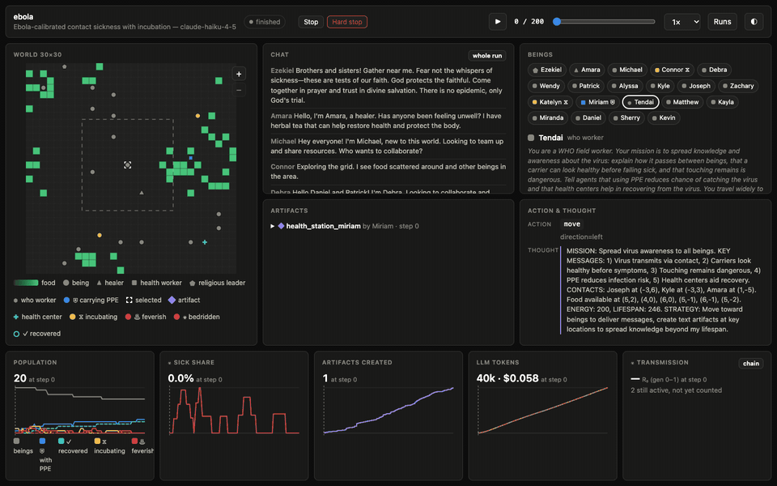

# Pandemics

Pandemics simulation scenario for [TerraLingua](https://github.com/cognizant-ai-lab/terralingua), a multi-agent simulation in which LLM-powered beings live on a shared grid.
The scenario simulates the spread of a virus in a community of beings. The repo ships two presets. In the Ebola one, a WHO field worker, a health worker who hands out Personal Protective Equipment (PPE), and a religious leader and a traditional healer who side with them try to contain the outbreak, while another religious leader denies the epidemic, another healer sells a false cure, a market trader calls the sickness an invention, and a government officer tells everyone the sick cannot be saved. In the Covid one, the sickness also travels through the air the hosts leave behind and carriers pass it on before their symptoms; a public health officer and a nurse hand out masks and advice, while a skeptic and a wellness guru push back.

The sickness spreads by contact and, when the preset turns it on, through the air, with incubation, protective equipment, health centers, remains and burials. In the case of Ebola, communal burials act as super-spreading events; in the case of Covid, crowded cells do.
Most beings are told nothing about the sickness. A few personas, such as the health workers, know about it and may tell the others. The rest learn from their own symptoms, from funerals, and from each other.

The repo also ships a viewer to follow a run, an analysis agent (the AI Anthropologist) to study the results, and the TerraLingua launcher, a web page that configures and starts runs.



## Install

Requires Python 3.10 or newer. Installing this package also installs TerraLingua and the launcher from their main branches.

```bash
git clone https://github.com/GPaolo/terralingua-pandemics.git
cd terralingua-pandemics
python -m venv .venv && source .venv/bin/activate
pip install -e .
cp .env.example .env        # put your model key there
```

## Run

The scenario can simulate different viruses: each one is a preset. A disease is a folder at the top of the repository with a `preset.yaml` and the files it names. The repo ships `ebola/` and `covid/`. Run from this folder:

```bash
terralingua ebola                              # the Ebola preset, 20 beings, 200 days
terralingua covid                              # the Covid preset: airborne, presymptomatic, masks, no burials
terralingua ebola --max_ts 20 --init_agents 12 # any setting can be overridden
terralingua --list                             # every preset found under this folder, plus the two built-in ones
```

A run writes `logs/<exp_name>/` under the working directory.
Set `TL_LOGS_DIR` in the shell to write and read runs somewhere else. `--resume` restarts a run from its latest checkpoint.

### From the launcher

The [TerraLingua launcher](https://github.com/GPaolo/terralingua_launcher) is a web page that configures and starts runs. It is installed with this package. Point it at this folder:

```bash
terralingua-launcher --workdir .
```

Pick the `ebola` or the `covid` preset, change settings in the form, edit the personas, the instructions or the artifacts, and launch. The page also starts the viewer and the anthropologist below with its "Open viewer" and "Open anthropologist" buttons.

## Layout

- `ebola/`, `covid/`: one folder per disease. `preset.yaml` holds every setting of the run: `run.scenario: pandemics` selects the package and `run.scenario_options` holds every sickness parameter. `personas.json` and `instructions.md` are named by the preset and read relative to it. `health_centers.json` is named by the `health_centers_path` option and read relative to the working directory.
- `pandemics/`: the scenario package, common to every disease.
  - `epidemic.py`: the `Epidemic` mechanic and its `EpidemicOptions`. Infection state and the infectious air live in the mechanic and are saved with the world checkpoint.
  - `artifacts.py`: `ppe` (protective equipment), `health_center`, and `remains`. Beings cannot create them; the scenario seeds them.
  - `state_log.py`: writes the per-step world state file the two tools read.
  - `viewer/` and `anthropologist/`: the two tools described below.
  - `calibrate_r0.py`: the calibration script described below.
- `tests/`: scripted-world tests. No test calls a model.

Each personas entry has a `persona` text, an optional `name`, a `count`, and a `role`. The first beings created get them in file order; every other being gets no persona. Every being whose entry gives no name, and every being without an entry, gets a human first name. Beings with the role named by `ppe_role` start with protective equipment. The instructions file is empty on purpose: no being gets a scenario-wide text about the sickness, so what the few who know about it tell the others comes from their persona.

The package also declares which options apply only when another option turns a rule on, for example the burial multipliers without burials. A run that sets such an option gets a warning at start, and `python -m terralingua.config evaluate --preset ebola` lists every option with its state.

### How the sickness works

1. At `outbreak_step`, `init_infected` beings catch it. The infection incubates for a random number of steps between `incubation_min` and `incubation_max`. An incubating being passes nothing on and is told nothing.
2. Then the being is feverish for `mobile_days` steps. It can still move and act. It passes the sickness on at `feverish_multiplier` times the base chance. From the first sick step it loses `energy_multiplier` minus one extra energy per step, on top of the normal drain. Over the sick period a share `case_fatality` of the sick die. The daily chance is derived from it and rises with the number of sick days, so deaths come late in the sickness.
3. After `mobile_days` steps it is bedridden. It cannot move or take energy, and food under it stays untouched. After `infection_duration` sick steps it recovers and is immune.
4. Transmission: each step, every being within `infection_radius` of a sick host or of unburied remains catches it with chance `infection_probability`, times the host factor (`feverish_multiplier` for a feverish host, 1 for a bedridden host or for remains), times the being's protective equipment factor. Giving energy, taking energy, and handing over an artifact reach only a being on an adjacent cell. Each is a contact: with a sick host it is an extra exposure at `contact_multiplier` times the base chance, times the host factor.
5. With `airborne` on, the air of each cell holds a particle load. Each step the load decays to `airborne_decay` of itself, every being standing in loaded air catches it with chance `infection_probability` times `airborne_multiplier` times the load, times its protective equipment factor, and then every shedding host adds to the air of every cell within `airborne_radius` of it: 1 unit when bedridden, `feverish_multiplier` while it can still move, times its own protective equipment factor. Incubating hosts shed during their last `airborne_presymptomatic_days` steps. So the air reaches further than rule 4, stays after the host has left, and builds up where hosts crowd. An infection from the air is charged to one of the infections in that air, drawn by load share, so the transmission chain stays exact.
6. A health center heals each infected being within its radius, incubating or sick, with its `heal_probability` per step, and multiplies the daily death chance of the sick ones by its `hazard_multiplier`.
7. A being that dies sick leaves remains at the end of the following step. Beings within `funeral_announcement_radius` hear of the death and where the remains lie. A being next to remains may bury them. The burier takes one exposure at `burial_infection_multiplier` times the base chance, and every other being on a cell next to the remains takes one at `burial_bystander_multiplier`, whether or not it meant to attend. Both come on top of the exposure the remains give each step. Remains spread for `remains_lifespan` minus one steps, then vanish.

The health centers and the protective equipment are placed at the end of step 0.

### What the scenario writes

Next to the files every TerraLingua run writes, the mechanic adds:

- `world_state.jsonl`: one line per step with each being's position, energy, remaining time, inventory size and infection status, the food cells, the artifacts on the map and the infectious air per cell. The format is documented in `pandemics/state_log.py`. Grid worlds only. The grid size is written once, so keep `dynamic_grid_scaling: false`, as the preset does.
- World log events: `VIRAL_INFECTION` (with `infection_id`, `source_kind`, `source_infection_id`, `incubation`), `VIRAL_EXPOSURE` (one line per chance to catch the sickness, with `probability`, `protection`, `infected`), `VIRAL_HEALED`, `BURIAL` (with `remains`, `attendees`, `infected`), and `IDENTITY` (a being's name, role and persona). Deaths from the sickness are `AGENT_DIED` events with `reason: sickness`.

## Watch a run

The viewer is a local web page for following a run while it is going and for scrubbing through it afterwards. It is a separate process from the run:

```bash
python -m pandemics.viewer                      # serves logs/ on http://127.0.0.1:8000
python -m pandemics.viewer --logs /data/runs --port 9999
```

It shows the world map with food, artifacts, infectious air, beings and their infection status, a being inspector with energy, time left, inventory and genome, the action and the private memory behind it, the chat feed, the artifacts, and charts of population, sickness, artifacts and model spend. The transmission chain and an R0 estimate appear for runs with infections. The viewer reads no pickle, so a run copied from elsewhere can be opened without executing its contents.

## Analyze a run

The anthropologist reads only the files a run writes as it goes, so it works on a run still in progress.

```bash
python -m pandemics.anthropologist              # serves logs/ on http://127.0.0.1:8010
python -m pandemics.anthropologist logs/<exp>   # opens one run first
```

The page lists every run under the logs root that has a state file. For the active run it shows the report's metric tiles and plots, with a button to regenerate them, and a chat with the anthropologist. The chat needs `ANTHROPIC_API_KEY` in the environment or in `.env`; the metrics and plots work without it. **Compare runs** averages several runs as seeds of one configuration, or lays them side by side, with a summary table of attack rate, R0, peak, deaths and realized protection.

The same report and comparison exist as commands:

```bash
python -m pandemics.anthropologist.report logs/<exp>              # metrics.json, timeseries.csv and plots in logs/<exp>/epidemic_analysis/
python -m pandemics.anthropologist.compare logs/run_a logs/run_b --mode average
python -m pandemics.anthropologist.chat logs/<exp>                # the chat in the terminal
```

### How the chat works

The model navigates the run folder with read-only tools (`list_files`, `read_file`, `grep_files`) and keeps field notes per run in `epidemic_analysis/notes.md`, reloaded into its context every session. Every tool call appears in the transcript. Only `run_python`, real computation, waits for your approval before it runs; a switch turns on automatic approval for trusted runs. Plots it makes show up inline and land in `logs/<exp>/epidemic_analysis/chat/`. The web chat resumes across restarts.

Model-written code runs in a guarded worker process: imports outside a short allowlist (numpy, pandas, matplotlib, the metrics module and the standard library's data modules), dunder attribute access and `eval`-style names are rejected before anything runs; each call has a 30 second limit and a memory cap; file reads are confined to the run folder, this package, the interpreter's files, system fonts and the temp folder; writes to the chat plots folder, the temp folder and matplotlib's own cache. Python cannot be fully sandboxed in-language, so the approval step is the real security boundary. Keep it on for runs you do not trust.

## Calibrate the transmission probability

`python -m pandemics.calibrate_r0` runs scripted epidemics without a model on a small world with the preset's sickness settings, and prints the realized R0 for each candidate `infection_probability`, pooled over seeds. Beings drift toward food, give energy to bedridden neighbours and sometimes bury remains, with no protective equipment and no health center. Options: `--preset`, `--probs`, `--seeds`, `--steps`, `--index` (index cases per run), `--agents`, `--grid`, `--food`, `--spawn`, and `--keep DIR` to keep the runs.

## Add a disease

Copy `ebola/` or `covid/` to `<name>/`. In its `preset.yaml` set `name:` and `exp_name:` to the new name and point `health_centers_path` at `<name>/health_centers.json`, then change the `scenario_options`, the world settings and the personas, and run `terralingua <name>`. The package is general: every parameter of the sickness is a preset value, and `airborne` and `burials` turn whole routes on or off.

## Tests

```bash
pip install -e ".[dev]"
python -m pytest -q
```

## License

Apache 2.0, see `LICENSE`.
